author: @gishi_yama
id: HeartRate
categories:JS
status: Draft
environments: Web
feedback link: mailto:ppu-qa@techitose.org

# センシングデータの利用実習（第2回）

## はじめに

<aside class="negative">

〈実演〉と書かれている部分は、皆さんが実際に操作する必要がある部分です。  
〈解説〉と書かれている部分は、前提となる知識などについて解説だけしている部分です。  

</aside>

<aside class="negative">

ブラウザはできるだけ Chrome, Firefox, Safari, Edge などの **最新版** を利用してください。Internet Explorer
や、前述のブラウザでも古いバージョンのものでは、正常にスクリプトが動作しない場合があります。

</aside>

<aside class="negative">

**生成AIを利用した場合は、レポート課題に記述する必要があるので、生成AIに送信したスクリプトと回答を記録しておくこと**。

**あなたがどのように生成AIを活用しているのかを評価したい** ので、その趣旨を汲み取った上で利用されたい。

当然、**あえて生成AIを利用しなかった場合に減点を行うものではない** ので、生成AIの利用は各自の判断に委任する。


</aside>

### 事前準備

#### 〈実演〉 HeatRate.htmlのダウンロード

ポータルから `HeartRate.html` をダウンロードする。

ダウンロードした `HeartRate.html` を、手元のPCのブラウザにドラッグアンドドロップして、以下のような画面がブラウザに表示されていることを確認する。

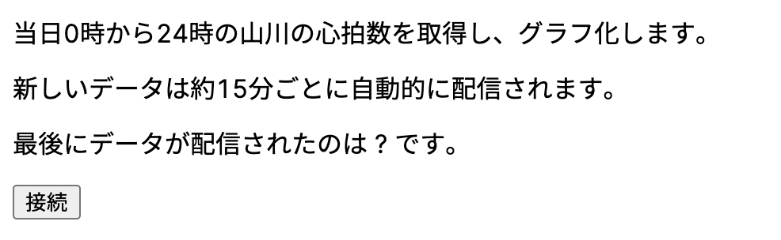

このファイルにJavaScript（JS）を組み込み、ある被験者が身につけているウェアラブルデバイスから、（ほぼ）リアルタイムな心拍数を取得できるようにする。

実習が成功すると、皆さんは離れた場所にいながら、他者の活動量（心拍数から予想される、活動の活発さや生活のリズム）を手元で把握できるようになるということである。

完成予定図は、以下のようになる。

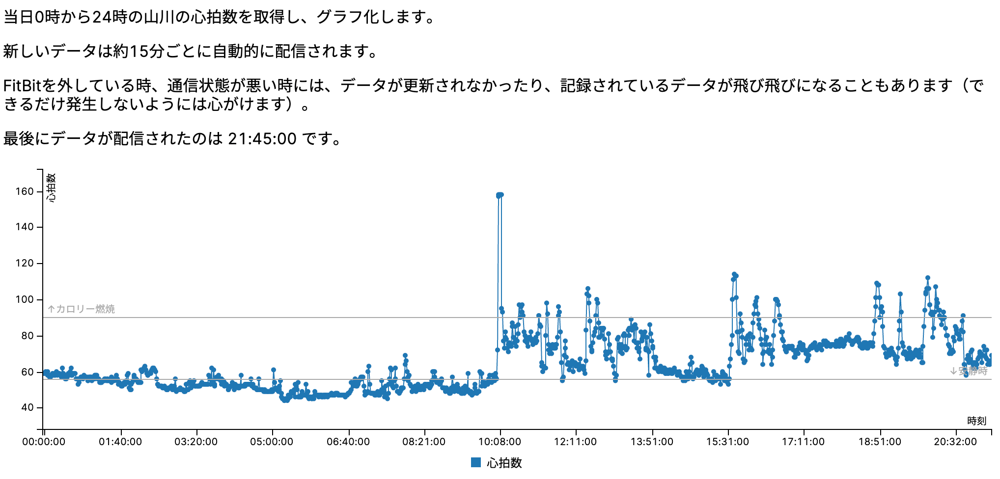

今回の実習では、**IoTシステムとしてもっとも基本的な「モノ（今回は、教員自身）が生体・環境の情報（今回は、心拍数）を、インターネットを通じて自動的に送信する」部分を体験** している。

もしこれらの仕組みを拡充し、**被験者を増やす・長期間運用することでデータ件数を増やすなどの方法でビッグデータ化** したり、その上で、**蓄積されたデータを高度に組み合わせ応用する・AI技術などを用いるなどの方法でデータ活用する**
ことができれば、対象となる場所を利用する人間に有用な情報サービスや、場所自体をよりよくする情報サービスを提供できる可能性がある。

こうした雰囲気や可能性を、実習を通じて体験する。


<aside class="negative">

この実習では、0時から24時までの心拍数が送られてくる。したがって、日付が変わった直後はデータが取得できていない状態から始まる。**実習や最後の動作確認は、日中のコアタイムや22時ごろまで** に行うとよい。  
また、被験者が何らかの理由（充電など）でウェラブルデバイスを外している場合や、通信状況が悪い場合（航空機での移動中など）はデータが途中で途切れたり、歯抜けになることもある。極力起こらないようにしたいが、長時間の発生が予想される場合は、授業ページで報告する。

</aside>

## HTMLファイルの内容確認

### 〈解説〉HeartRate.htmlの内容

`HeartRate.html`
を、 **テキストエディタで** 開く。（前回のJSの課題と同じもの。
スマホアプリのメモ帳やワープロソフトは、見た目と実際のデータの間で差異が生じる場合があるので、オススメしない ）

テキストエディタに、以下のような文章が表示されることを確認する。

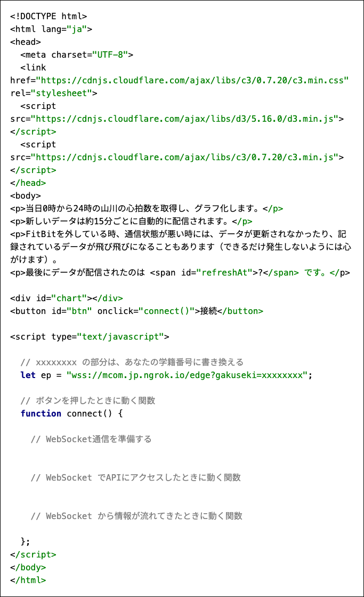

ここで、`&lt;link href=... &lt;/link&gt;` の部分や、 `&lt;script src="... &lt;/script&gt;`
の部分は、あなたのプログラムに「グラフを描画できる機能」を提供してくれるライブラリを読み込んでいる。（ライブラリの役割は、授業の動画で解説している）

画面を表示するHyperTextには、それぞれの部分に `id` が名前としてつけられている。名前をつけられた部分がどのように画面に表示されるかをプログラム（JSのスクリプト）で書き換えられることは、前回の実習で練習をした通りである。

## クラウド上のエンドポイントの接続準備

**被験者の心拍数は、クラウドシステムを通じてリアルタイムなデータとして絶えず提供** される。このデータを取得するために、 **WebSocket** を用いる。（WebSocketについては、過去の授業で取り上げているので、過去の資料を参考にすること）

WebSocket では、Web-APIとなる **「エンドポイント」からデータが送られてくる** ため、HyperText上でエンドポイントに接続するためのスクリプトを作る。

### エンドポイントに接続する準備を行う

今回も、HyperTextの中の

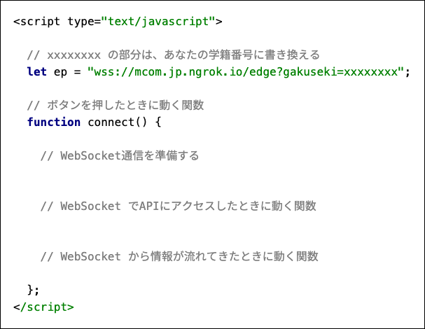

の部分にスクリプトを記述していく。

#### 〈実演〉手元のファイルを変更する

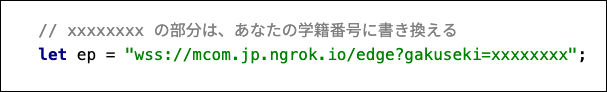

のコメントアウトの指示の通り、 `xxxxxxxx` の部分を、あなたの学籍番号（最初のアルファベットは英数小文字にすること
例：b1992490）へと書き換える。 **ここがあなたの学籍番号になっていない場合、後半の手順でうまくいかない** ので注意すること。

ここで `ep` 変数に宣言されている `wss://mcom...` は、二酸化炭素濃度を提供するクラウドのURLである（URLについては、過去の授業で取り上げているので、過去の資料を参考にすること）。
このURLの中で、 `wss://` スキーマは、WebSocket通信のルールを用いてクラウド側のエンドポイントとやりとりを行うことを指定している。

## エンドポイントに接続する

### 〈実演〉スクリプトを記載する

JSでクラウド上のエンドポイントに接続するため、ブラウザのWebSocket機能をプログラムから呼び出す。

**// WebSocket通信を準備する** の下に、スクリプトを追加する。

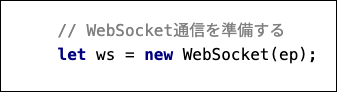

`new WebSocket(ep)` は、エンドポイントのアドレス（今回は、`ep` 変数に参照されている `wss://mcom...`）に接続するためのブラウザ機能を用意するスクリプトである。

次に、 `connect` 関数の中の **// WebSocket でAPIにアクセスしたときに動く関数** の中に、スクリプトを追加する。

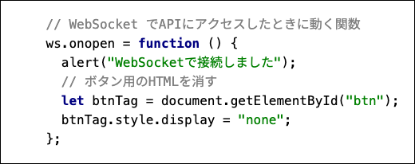

### 〈解説〉

`ws.onopen = ...` の部分は、**WebSocketエンドポイントに接続が成功した場合の関数を宣言している** 。

`connect` 関数の中のプログラムでは、接続が成功すると、ブラウザの画面上に **WebSocketで接続しました** という警告ダイアログが表示されるようにしている。また、

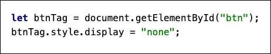

の部分は、HyperTextの中の `"btn"` つまり、ボタン部分のタグを非表示にするスクリプトである。

### 実行する

ブラウザで `HeartRate.html` を再表示する（ドラッグアンドドロップでも、ブラウザの更新ボタンでもよい）。

**表示された画面で「送信」ボタンを押し、警告ダイアログが表示され、送信ボタン自体が消えれば、WebSocketエンドポイントに接続が成功** している（クラウドの利用状況によっては時間がかかる場合もある。変化がない場合は5~
7秒程度待つ）。

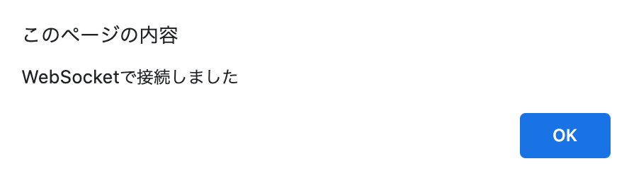

**時間が経ってもダイアログが表示されなかったり、送信ボタンが消えない場合は接続に失敗している** ので、スクリプトの記載のミスなどがないか確認する。

## エンドポイントからのデータを受信する

エンドポイントへの接続が成功した場合は、エンドポイントから被験者の心拍数が定期的に送られてくる。このデータを正常に受け取ることができるかを確認するためのスクリプトを作る。

### 〈実演〉connect 関数の中に処理を追加する

前の段階で作成した `connect` 関数の中の、 **// WebSocket から情報が流れてきたときに動く関数** の部分にスクリプトを作成する。

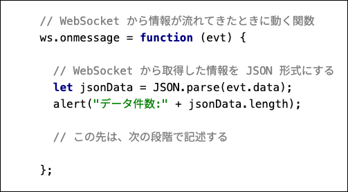

#### 〈解説〉

`ws.onmessage = ...` の部分は、**WebSocketエンドポイントからデータが送られた場合の関数を宣言** している。

`evt` 変数は、エンドポイントから遅れてきた生のデータ、 `message` 変数にあてはめた `evt.data` は、 `evt` の生データから、処理に必要な部分のみを切り出したものである。

このスクリプトを実行すると、心拍数のデータが

```json
[
  {
    "time": "00:00:00",
    "value": 59
  },
  {
    "time": "00:01:00",
    "value": 59
  },
  {
    "time": "00:02:00",
    "value": 60
  },
  {
    "time": "00:03:00",
    "value": 59
  }
  ...
]
```

のような、**0時からの記録時間と心拍数の値の配列状のデータ** として取得できる。**こうしたデータ形式がJSON形式** である。

#### 実行する

ブラウザで `HeartRate.html` を再表示する（ドラッグアンドドロップでも、ブラウザの更新ボタンでも良い）。

表示された画面で「送信」ボタンを押すと、「WebSocketで接続しました」のダイアログのあとに、**新たに「データ件数: xxxx」（xxxxは任意の数字）が記載されたダイアログも表示される**。

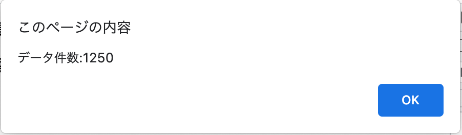

この数字（たとえば画像では `1250`）は、Endpointから取得できた心拍数のデータ件数（配列の長さ）である。**決まった数字ではなく、1日の後半になればなるほど大きな数が表示される**。

#### 次の段階にむけて

ここまで動作確認ができたら、毎回ダイアログが表示されるのは邪魔なので、スクリプトを修正する。

2箇所の `alert` の部分を `console.log` に書き換えると、接続成功メッセージや、データ件数は表示されなくなり、ブラウザの中で処理される。

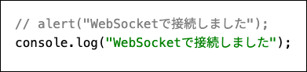

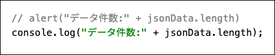

<aside class="negative">

`console.log` に書かれたメッセージは、ブラウザの開発モードなどで確認できようになる。興味がある学生は調べてみるとよい。

</aside>

## ここまでのスクリプトの確認

ここまでの課題がうまく進んでいれば、以下のような内容になっている。記述の間違いなどがないことを確認しておくとよい（xxxxxxxx の部分は各自の学籍番号になっているはずである）。

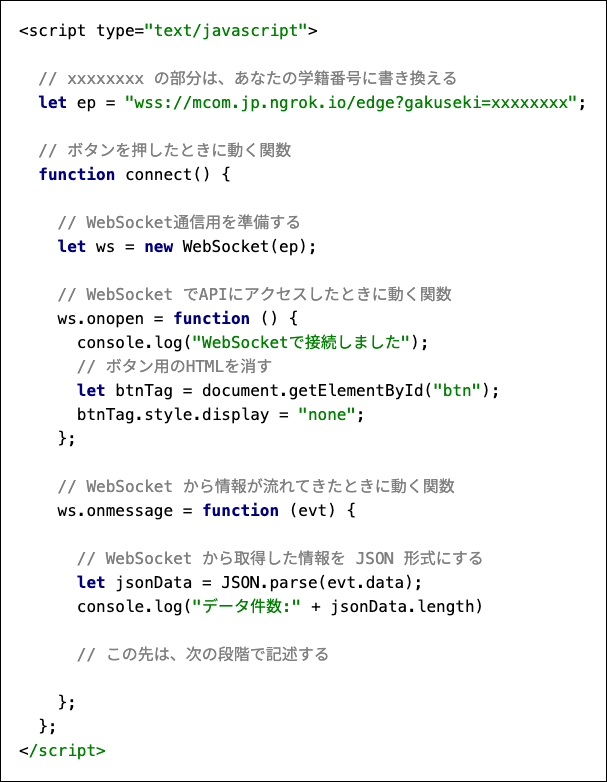

## 最後にデータを取得した時間を掲載する

画面上に、最後にデータを取得できた時間を掲載する。具体的には、図の ? の部分に、時刻を掲載する。


### 〈実演〉connect 関数の中に処理を追加する

前の段階で **// この先は、次の段階で記述する** と記載した部分に、以下のスクリプトを記述する。

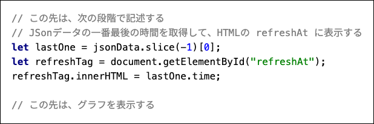

#### 〈解説〉

```js
let lastOne = ...
```

の部分は、JSONデータの一番最後のデータを取り出すスクリプトである。

```js
let refreshTag = ...
refreshTag.innerHTML = ...
```

の部分は、HyperTextの `?` を指定する `refreshAt` がついたタグを指定して上で、JSONデータの一番最後のデータの `time` の情報で上書きするスクリプトである。

#### 実行する

ブラウザで `HeartRate.html` を再表示する（ドラッグアンドドロップでも、ブラウザの更新ボタンでも良いです）。

表示された画面で「送信」ボタンを押すと、`?` の部分に **最後に取得したデータの時刻が表示** される。（現在時刻ではなく、WebSocketエンドポイントからデータが取得できた時刻であることに注意）。


`?` のまま表示が変わらない場合は、スクリプトが間違っている可能性がある。また、0時（24時）付近は表示されるためのデータが揃っていない場合もあるので、該当する場合は時間を変えて実行してみるとよい。

## グラフを表示する

ここまでの課題が順調にできていれば、すでにブラウザにはグラフを表示するための、毎分ごとの心拍数が届いている。これをグラフ化する。

### 〈実演〉connect 関数の中に処理を追加する

前の段階で **// この先は、グラフを表示する** と記載した部分に、以下のスクリプトを記述する。

なお、ここの記述方法はこれまでの書き方と異なり、ミスも多いので、コピー＆ペーストしてもよい。

```js
/// この先は、グラフを表示する
// グラフを表示する
c3.generate({
  bindto: "#chart",
  data: {
    json: jsonData,
    keys: {
      x: "time", value: ["value"]
    },
    names: {
      value: "心拍数"
    }
  },
  axis: {
    x: {
      label: {text: "時刻"},
      type: "category",
      tick: {culling: true, fit: false, width: 200}
    },
    y: {
      label: {text: "心拍数"},
      max: 160,
      min: 40
    }
  },
  grid: {
    y: {
      lines: [
        {value: 90, text: "↑カロリー燃焼", position: "start"},
        {value: 56, text: "↓安静時", position: "end"}
      ]
    }
  }
});
```

#### 〈解説〉

これは、HyperText上に読み込んでいるライブラリ: c3.js でグラフを表示する部分である。

ライブラリは、

```html

<script src="https://cdnjs.cloudflare.com/ajax/libs/d3/5.16.0/d3.min.js"></script>
<script src="https://cdnjs.cloudflare.com/ajax/libs/c3/0.7.20/c3.min.js"></script>
```

の部分で読み込みされている。

`c3.generate...` の部分で、グラフの設定を行っている。代表的な設定内容だけを解説すると、

- `bindto` は、グラフをさしこむタグのidを指定する
- `data` は、グラフに表示するJSONデータを指定し、x軸に表示するデータの値や、心拍数の値の名前を設定する。
- `axis` は、軸の詳細を設定する。
    - `x` は、x軸に表示する内容や、個数を設定する。
    - `y` は、y軸に表示する内容や、最大・最小値を設定する。
- `grid` は、グラフ上の追加設定をおこなう。この場合は、心拍数56以下が主に睡眠の領域であること、心拍数90以上はカロリー消費が進む領域であることを示す基準線を引く。

#### 実行する

ブラウザで `HeartRate.html` を再表示する（ドラッグアンドドロップでも、ブラウザの更新ボタンでも良いです）。

表示された画面で「送信」ボタンを押すと、これまでの情報に加え、折れ線グラフで1日の心拍数が可視化される。


#### スクリプトの最終形

最終的な課題のスクリプト全文を[載せておく。うまく動かない場合は参考にしてよい。

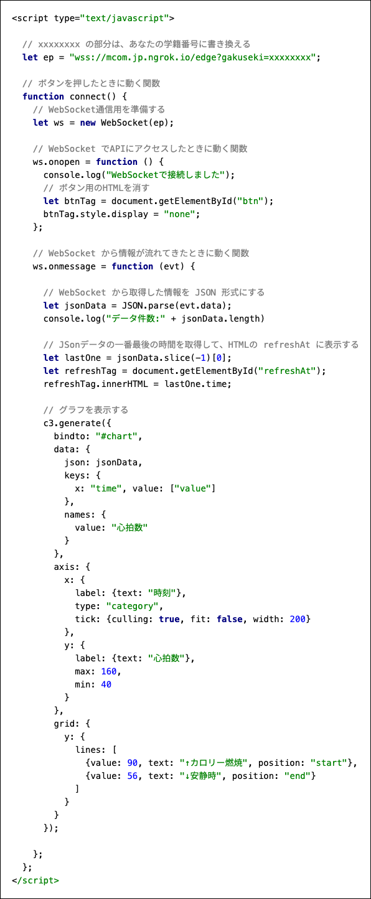


## 提出物(採点対象)

提出物は二つである。

- 完成したプログラムは、授業ページのレポートBOXから提出しなさい。
- プログラムを実行した上で、次ページの指示に沿ったレポート課題を作成し、こちらも授業ページのレポートBOXから提出しなさい。

## レポート課題の指示

あなたが表示できるようにしたグラフを見て、ある日の被験者の行動を読み取り、検討した結果をレポートとしてまとめなさい。

レポートは項目ごとに章だてをして記述し、PDFファイルとして出力し提出すること。

### 1. あなたが被験者の心拍数を確認した日時

あなたがグラフを表示した日時を記入しなさい。

### 2. 睡眠時間

心拍数56以下が続いている時間は、主に睡眠をしている時間と推測される。あなたがグラフを表示した日、山川はどの程度睡眠しているか。

### 3. 平静にしている時間

心拍数56〜90の間が続いている時間は、椅子に座るなど、平静にしている時間と推測される。あなたがグラフを表示した日、山川はどの程度平静にしているか。

### 4. 積極的に活動している時間

心拍数が90以上が続いている時間は、体を動かしたり、体に負担がかかるような活動をしている時間と推測される。あなたがグラフを表示した日、山川はどの程度積極的に活動しているか。

### 5. 被験者へのアドバイス

上記1-3の情報をもとに、山川が「健康的に過ごしたい」と悩んでいたとしたら、あなたはどのような助言を考えるか。

判断が必要なデータがあればWebや書籍で調べる・生成AIの回答を参考にするなどの上で、助言を考えなさい。

### 6. 参考文献

調べたWebサイトや書籍があれば、必ず参考文献として記載すること。

使用しなかった場合は、レポートにこの項目を設けなくて良い。

参考文献の書き方は [科学技術振興機構による 参考文献の書き方](https://warp.ndl.go.jp/info:ndljp/pid/12003258/jipsti.jst.go.jp/sist/pdf/SIST_booklet2011.pdf) の例に従うこと。

参考文献の記述がなく、他者の著作物を無断で引用したと判断できる箇所が見受けられた際は、減点を行う場合がある。

（当然、他者のレポートの複製と判断できる箇所が見受けられた場合も、減点を行う）

### 7. 生成AIの利用

生成AIを利用した場合は、（レポート部分に限らず、プログラム部分でも）使用した箇所と、その際のスクリプトを報告すること。

使用しなかった場合は、レポートにこの項目を設けなくて良い。

スクリプトの報告なく、生成AIの回答そのままの引用と判断できる箇所が見受けられた際は、減点を行う場合がある。

<aside class="negative">

前述の通り、**出題者は生成AIの性能を評価したいのではない**。

**生成AIを利用した場合は、あなたがどのように生成AIを活用しているのかを評価したい** ので、その趣旨を汲み取った上で利用されたい。

当然、**あえて生成AIを利用しなかった場合に減点を行うものではない** ので、生成AIの利用は各自の判断に委任する。

</aside>

以上