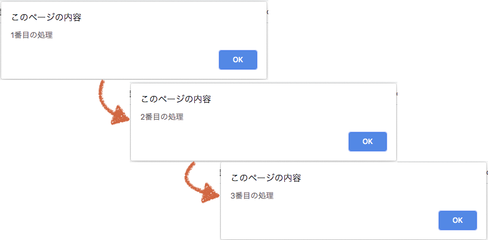

author: @gishi_yama
id: JSTraining
categories:JS
status: Draft
environments: Web
feedback link: mailto:cist-mcom-qa@googlegroups.com

# センシングデータの利用実習（第1回）

## はじめに

Negative
: 〈実演〉と書かれている部分は、皆さんが実際に操作する必要がある部分です。  
〈解説〉と書かれている部分は、前提となる知識などについて解説だけしている部分です。  
〈挑戦〉と書かれている部分は、そこまでの内容を理解しているか、自分でチャレンジをしてみてください。

### 事前準備

#### (1) 〈実演〉 JSTraining.htmlのダウンロード

ポータルから `JSTraining.html` をダウンロードしてください。

ダウンロードした `JSTraining.html` を、手元のPCのブラウザにドラッグアンドドロップして表示してください。


以下のような画面がブラウザに表示されていることを確認してください。


#### (2)  〈実演〉JSTraining.htmlの編集

`JSTraining.html`
を、 **手元のPCのメモ帳やテキストエディタで** 開いてください。（他に普段利用しているテキスト編集ソフトがあれば、それを使ってもかまいません。 **ただし、スマホアプリのメモ帳やワープロソフトは結果が変わってしまうことが多いので、オススメしません**）

メモ帳やテキストエディタに、以下のような文章が表示されることを確認してください。


これが、 **ブラウザへの画面表示を指示しているHTML（Hyper Text）** です。

**HyperTextを人間が直接書き換えたり、JavaScript（JS）で書き換えることで、ブラウザへの画面表示を変化させる** ことができます。

ここから先は実際に JS の簡単な文法を練習し、ブラウザに表示されている画面を変化させてみましょう。

## Training1 順次処理

実際に JS のスクリプト命令を書き、実行順を確認してみましょう。

### (1)  〈実演〉JSを書いてみる

HTMLを書き換える JS を書く方法には色々なものがありますが、ここでは一番ベーシックな方法として、HyperTextの中の


の部分にスクリプトを書くことにします。

この部分を、次の様に書き換えてみてください。


書き換え終わったら、変更内容を保存してください。

保存ができたら、ブラウザで `JSTraining.html` を再表示してみてください（ドラッグアンドドロップでも、ブラウザの更新ボタンでも良いです）。

以下のように、警告ダイアログが表示されれば成功です。（ブラウザによって、見栄えは異なります）


`alert` は、ブラウザの画面上に警告ダイアログを出す命令です。 書き換えたスクリプトでは `1番目の処理` というテキストをブラウザ上の警告ダイアログに表示するよう命令しています。

### (2) 〈実演〉順次処理

JSは原則、上から書かれているスクリプトの順に命令を実行します。先ほどの警告ダイアログを出す命令を増やしてみましょう。

**手元のファイルを変更してください：**


変更内容を保存した後、ブラウザで `JSTraining.html` を再表示してみてください。

**1番目**の処理 → **2番目**の処理 → **3番目**の処理 と書かれた警告ダイアログが、順番に表示されましたか？



### (3) コメントアウト

動作が確認できたら、ここまで書いた内容をコメントアウトにし、無効にしましょう。

`//` をつけた行のスクリプトが無効になります。

**手元のファイルを変更してください：**


変更内容を保存した後、ブラウザで `JSTraining.html` を再表示してみてください。

警告ダイアログが表示されなくなりましたか？

## Training2 変数

JSで変数を扱ってみましょう。

JSでは、変数を `let` や `const` というキーワードで作成します。

```js
  let 変数名 = 値;
```

のように宣言します。

### (1) 〈実演〉変数を宣言する

`JSTraining.html` のプログラムを、以下のように変更してください。

**手元のファイルを変更してください：**


変更内容を保存した後、ブラウザで `JSTraining.html` を再表示してみてください。

警告ダイアログに **16+2は** と表示されましたか？

### (2) 〈実演〉データ形式と変数

`JSTraining.html` のスクリプトを、以下のように変更してください。

**手元のファイルを変更してください：**


変更内容を保存した後、ブラウザで `JSTraining.html` を再表示してみてください。

警告ダイアログが **16+2は** → **18** の順に表示されましたか？


### ここでのポイント part.1

JavaScriptでは、データが文字列形式の場合は `""` や `''` でくくり、数値形式の場合はそのまま数値を書きます。

### ここでのポイント part.2

JavaScriptの変数宣言では、 **C言語などの変数宣言と違い、「データの形式にあわせて、変数の型を宣言しなくて良い（`let` の部分を変えなくて良い）」**  ことに注意しましょう。

たとえばＣ言語で同じプログラムを書くと、

```c
// C言語のプログラムではこんな感じになるはず
char quiz[] = "16+2は";
printf("%s", quiz);
int ans = 16 + 2";
printf("%d", ans);
```

のように、データ形式にあわせて `char`（の配列）, `int` のように、変数の型を指定する必要がありました。

JS の変数ではスクリプトの実行時に、どんなデータ形式の変数なのかを都度判断され命令が実行されるため、データ型ごとに使い分ける必要がないのです。

Negative
: **NoteThat:（興味がある人向け）**  
JS では、データ型ではなく、変数の性質（どこから利用できる変数か？変数はどのように使えるか？）で、宣言する方法が異なります。  
`var arg = ... ;` と宣言すると、argはグローバル変数のようにスクリプト内のでどこからでも利用・変更可能な変数になります。  
`let arg = ...;` と宣言すると、argは {} などで囲まれたブロックごとに分けて宣言でき、変更可能な変数になります。  
`const arg = ... ;` と宣言すると、argは {} などで囲まれたブロックごとに分けて宣言でき、変更ができない「定数」になります。  
この授業では、皆さんが使い分けをしなくてすむように、**`let` で統一** します。

## Trainging3 HyperTextを書き換える

ここまでトレーニングしたJSの文法も使い、実際にブラウザ上の画面を変更します。

ブラウザ上の画面を変更するためには、HyperTextの中で **書き換える場所を指定し、書き換える内容を設定します** 。

### (1) 〈解説〉HyperTextについて簡単に

HyperTextは、以下のような構成になっているデータ文章です。

#### タグ

```html
<タグ>値</タグ>
```

タグは、**<タグ>〜</タグ>** の間が画面の部品であることをブラウザに伝える符号です（このことをマークアップ、といいます）。画面に表示されるときには、**タグでマークアップされている部分ごとに見せ方を変えて、値の部分が表示されます** 。

たとえば、

```html
<h1>こんにちは！</h1>
<p>千歳 光です</p>
```

という HyperTextは、 **「H1は見出し、pは段落文章にする」** という見せ方を示しており、


の様に、タグの種類ごとに、画面に表示される形が変わります。

また、タグは入れ子構造にすることもできます。

```html
<p>彼は、<strong>その時間は家にいた</strong>と説明した。</p>
```

という HyperTextは、 **「pは段落文章、strongは強調する」** という見せ方を示しており、


の様に、段落文章の中で一部分を強調表示するように、画面に表示される形が変わります。

#### プロパティ

タグにはプロパティという値を設定できます。

プロパティには、タグを区別するための名前や、画面に表示される形のための補足情報などを設定できます。

```html
<p id="foo">こんにちは</p>
<p id="bar">さようなら</p>
```

の `id="foo"`  `id="bar"` の部分がプロパティです。この例は、それぞれのpタグのマークアップ部分に `foo`, `bar` という区別できる名前をつけていることになります。

### (2) 〈解説〉HyperTextの値やプロパティをJSで書き換える

ブラウザの画面に値がどんな形で表示されるかは、HyperTextのタグ（やそのプロパティ）と値によって左右されます。

つまり、**タグのプロパティ・値などをJSのスクリプトで書き換えること＝ブラウザの画面をプログラムで変化させること** になります。

タグのプロパティ・値などを書き換えるには、次のようなJSのスクリプトを使います。

```js
document.getElementById(書き換えたいタグのid).書き換える項目 = 書き換え後の値;
```

たとえば、

```html
<p id="foo">こんにちは</p>
<p id="bar">さようなら</p>
```

をそれぞれ、`Hello`、`See you` のような英語表示に書き換えるプログラムは、

```js
// foo のタグの表示内容を Hello. に変える
document.getElementById("foo").innerHTML = "Hello.";
// bar のタグの表示内容を See you. に変える
document.getElementById("bar").innerHTML = "See you.";
```

のようになります。

### (3) 〈実演〉JSTraining.htmlのHyperTextを書き換える

`JSTraining.html` のプログラムを、以下のように変更してください。

- まず、 Trainging2 で変更した内容をコメントアウトする
- `id="gakuseki"` の名前がついている p タグの値を、あなたの学籍番号に書き換える（ここでは例として、`b1992490` があなたの学籍番号だとしています）

**手元のファイルを変更してください：**


変更内容を保存した後、ブラウザで `JSTraining.html` を再表示してみてください。


**あなたの学籍番号：?** と表示されていた部分が、 **あなたの学籍番号：b1992490** のように変化していますか？

これは下図の様に、JSのスクリプトが、HyperTextの中から `id="gakuseki` になっているタグを探しだし、 `?` の所を書き換えるように動いているためです。


### (4) 〈実演〉計算結果（加算）、計算結果（減算）を書き換える

さらに、**計算結果（加算）：?**、**計算結果（乗算）：?** の `?` の部分に、それぞれ 5 + 5、5 * 5 の結果が表示されるよう、スクリプトを付け加えてみましょう。

**学籍番号を表示するスクリプトの後に、さらに追記してください：**


変更内容を保存した後、ブラウザで `JSTraining.html` を再表示してみてください。


学籍番号の下に、加算、乗算の結果が表示されていますか？

## Trainging4 関数

関数は、処理の一部を別の場所に切り離す方法です。関数を使うことによって、複数の処理を1つにまとめて部分部分の流れをわかりやすくしたり、何度も同じ命令を使う部分を共通のスクリプトにまとめることができます。

JS では、関数を以下のような構文で記述します（いくつかあるうちの、基本的な書き方です）。

```js
function 関数名(引数1, 引数2, ...) {
  // 関数化したい処理
}
```

### 〈実演〉 Trainging3 のプログラムを関数でまとめる

Trainging3 のプログラムでは、HyperTextを書き換える、`document.getElement...` 部分の多くの文字が重複しています。

これをひとつの関数にまとめてみましょう。

- まず、 Trainging3 で変更した内容をコメントアウトする
- タグの内容を変更する rewrite 関数を作成し、HypertTextの学籍番号、加算、乗算の部分はこの関数を使って変更する。(わかりやすいように、計算結果を `6 + 3` , `6 * 3` に変える)

**手元のファイルを変更してください：**


変更内容を保存した後、ブラウザで `JSTraining.html` を再表示してみてください。


学籍番号と、新しい計算式での足し算、引き算の結果が表示されていますか？

## Trainging5 イベント

### (1) 〈解説〉 イベントとJavaScriptの関数

ブラウザの画面は、何か情報を見るためだけではなく、ボタンを押す、処理に必要な値を送信する（例：出席パスワードなど）という用途にも使われます。

このため、HyperTextやJSでは、**ユーザーの操作（これを、イベントと呼びます）をきっかけに、プログラムを動かせるようになっています。**

たとえば、  `JSTraining.html` の中には、

```html
<button id="btn" onclick="push()">ボタンを押してください</button>
```

という部分があります。この部分が、「押してください」と書かれているボタンを表示している箇所になりますが、 **`onclick="push()"` は、
ボタンが押されたとき（つまり、これがイベント）に、JStのpush関数を実行する、という意味** になります。

### (2) 〈実演〉 push関数を作成する

Training4で作った rewrite関数とは別にpush関数を作り、ボタンが押されたときの動作を作成しましょう。

**rewrite関数の下に、追記してください：**


変更内容を保存した後、ブラウザで `JSTraining.html` を再表示してみてください。


「押してください」ボタンを押すと、 **ボタン：まだ押されていません** が、 **ボタン：押されました！** に変化しますか？

## 〈挑戦〉

ここまでのトレーニング内容を参考に、次の様に動く画面になるように、JavaScriptのプログラムを変更してください。

1. **計算結果（加算）と計算結果（乗算）の `?` には、最初は `?` → `0` が表示される**
2. **「押してください」ボタンを押すと、 これをイベントにして計算結果（加算）の `?` には `7 + 3` の結果が、 計算結果（乗算）の `?` には `7 * 3` の結果が表示されるようにする**


Negative
: **Hint:** ボタンを押す前と、ボタンを押した後（つまり、push関数が呼ばれたとき）で、JavaScriptがどのようにHyperTextを書き換えるようなプログラムになればいいでしょうか。

挑戦の結果、完成した `JSTraining.html` をポータルのレポートBOXに提出してください。

お疲れ様でした。
